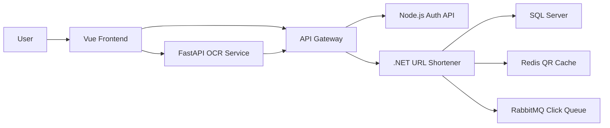

<div align="center">
  

  <h1>BiteLink URL Shortener</h1>

  <p>
    <strong>A modern URL shortening platform</strong> with user authentication,
    link management, QR code support, OCR-based URL extraction, and a service-oriented backend.
  </p>

  <p>
    <a href="#-features">Features</a> •
    <a href="#-architecture">Architecture</a> •
    <a href="#-installation">Installation</a> •
    <a href="#-running-the-project">Running</a> •
    <a href="#-license">License</a>
  </p>

  <p>
    
    
    
    
    
  </p>
</div>

---

## Overview

**BiteLink** is a full-stack URL shortening system built with a service-oriented architecture. The project combines a Vue 3 frontend, an ASP.NET Core URL shortener API, a Node.js authentication service, a FastAPI OCR service, and infrastructure components such as SQL Server, Redis, RabbitMQ, and an API Gateway.

The application allows users to create shortened links, define custom aliases, manage their URL list, store QR codes, track clicks asynchronously, and extract URLs from images using OCR.

## Features

<table>
  <tr>
    <td><strong>URL Shortening</strong></td>
    <td>Create short links from long URLs with support for custom aliases and expiration dates.</td>
  </tr>
  <tr>
    <td><strong>User Authentication</strong></td>
    <td>Login, refresh tokens, token validation, and protected private APIs using JWT.</td>
  </tr>
  <tr>
    <td><strong>URL Management</strong></td>
    <td>View, inspect, and delete URLs owned by the authenticated user.</td>
  </tr>
  <tr>
    <td><strong>QR Code Support</strong></td>
    <td>Store and retrieve QR codes for shortened URLs using Redis cache.</td>
  </tr>
  <tr>
    <td><strong>Click Tracking</strong></td>
    <td>Publish click events through RabbitMQ for asynchronous processing.</td>
  </tr>
  <tr>
    <td><strong>OCR URL Extraction</strong></td>
    <td>Upload an image, detect a valid URL with EasyOCR, and send it to the URL shortener service.</td>
  </tr>
</table>

## Architecture

```text
FE/URL-Shorten-FE       Vue 3 + Vite client
BE/auth-api             Node.js + Express authentication service
BE/AMD API/UrlShortener ASP.NET Core URL shortener service
BE/AMD API/ApiGateway   ASP.NET Core API Gateway
BE/AMD API/OcrService   FastAPI + EasyOCR service
BE/AMD API/docker-compose.yml
                        SQL Server, Redis, RabbitMQ, and backend services
```

### Main Flow



## Tech Stack

| Layer | Technologies |
| --- | --- |
| Frontend | Vue 3, Vite, Vue Router, Bootstrap, Axios, Firebase |
| Authentication | Node.js, Express, JWT, bcryptjs, MSSQL |
| URL API | ASP.NET Core, Entity Framework, SQL Server |
| Gateway | ASP.NET Core, Ocelot |
| OCR | FastAPI, EasyOCR, Pillow, httpx |
| Infrastructure | Docker, Docker Compose, Redis, RabbitMQ, SQL Server |

## Installation

### Requirements

- Node.js 18+
- npm
- A compatible .NET SDK for the backend projects
- Python 3.9+ if running the OCR service manually
- Docker Desktop if running the infrastructure with Docker Compose

### Clone The Repository

```bash
git clone <repository-url>
cd AMD201
```

## Running The Project

### 1. Frontend

```bash
cd FE/URL-Shorten-FE
npm install
npm run dev
```

The Vite development server usually runs at:

```text
http://localhost:5173
```

### 2. Authentication Service

```bash
cd BE/auth-api
npm install
npm run dev
```

The authentication service uses:

```text
http://localhost:3000
```

### 3. Backend And Infrastructure With Docker Compose

```bash
cd "BE/AMD API"
docker compose up --build
```

Main service ports:

| Service | URL / Port |
| --- | --- |
| URL Shortener API | `http://localhost:5005` |
| API Gateway | `http://localhost:5006` |
| OCR Service | `http://localhost:8001` |
| RabbitMQ Management | `http://localhost:15672` |
| SQL Server | `localhost:1433` |
| Redis | `localhost:6379` |

> Note: `docker-compose.yml` currently contains an absolute `build.context` path for `nodejs-auth`. If you run the project on another machine, update that context to point to your local `BE/auth-api` directory.

## Important Environment Variables

| Variable | Purpose |
| --- | --- |
| `JWT_SECRET` | Secret used to sign access tokens |
| `JWT_REFRESH_SECRET` | Secret used to sign refresh tokens |
| `DB_CONFIG_*` | SQL Server connection settings for the auth service |
| `ConnectionStrings__DefaultConnection` | Database connection string for the .NET API |
| `AuthServiceUrl` | Internal URL for the authentication service |
| `Redis__ConnectionString` | Redis cache connection string |
| `RabbitMQ__*` | RabbitMQ configuration |
| `URL_SHORTENER_SERVICE_URL` | Gateway URL used by the OCR service |

## API Highlights

| Method | Endpoint | Description |
| --- | --- | --- |
| `POST` | `/api/auth/login` | Authenticate a user |
| `POST` | `/api/auth/refresh-token` | Refresh an access token |
| `GET` | `/api/auth/me` | Get the current authenticated user |
| `POST` | `/api/url/shorten` | Create a shortened URL |
| `GET` | `/api/url/list` | Get the authenticated user's URLs |
| `GET` | `/{shortUrl}` | Redirect to the original URL |
| `DELETE` | `/api/url/{shortUrl}` | Delete a shortened URL |
| `POST` | `/api/url/{shortUrl}/qr` | Save a QR code |
| `GET` | `/api/url/{shortUrl}/qr` | Retrieve a QR code |
| `POST` | `/api/ocr/upload` | Upload an image and shorten the detected URL |

## Project Structure

```text
AMD201
├── BE
│   ├── auth-api
│   └── AMD API
│       ├── Api
│       ├── ApiGateway
│       ├── OcrService
│       ├── UrlShortener
│       └── docker-compose.yml
├── FE
│   └── URL-Shorten-FE
├── LICENSE
└── README.md
```

## Development Notes

- Do not commit real secrets to the repository. Use `.env`, user secrets, or a secret manager for deployment.
- Review connection strings for local, staging, and production environments.
- Normalize Docker `build.context` values so they do not depend on a personal machine path.
- Consider adding database migrations and seed data if the project must be reproducible from a clean environment.

## License

This project is released under the **MIT License**. See [LICENSE](./LICENSE) for details.

---

<div align="center">
  <sub>Built with Vue, .NET, Node.js, FastAPI, Redis, RabbitMQ, and SQL Server.</sub>
</div>
